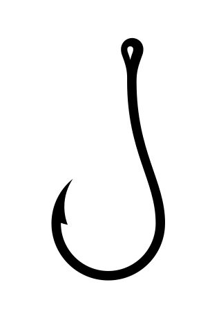

# Event Emitting and Async Middleware Hooks

[](https://github.com/jaredwray/hookified/actions/workflows/tests.yaml)
[](https://github.com/jaredwray/hookified/blob/master/LICENSE)
[](https://codecov.io/gh/jaredwray/hookified)
[](https://npmjs.com/package/hookified)
[](https://npmjs.com/package/hookified)

## Features
- Simple replacement for EventEmitter
- Async Middleware Hooks for Your Methods
- ESM / CJS with Types and Nodejs 20+
- Maintained on a regular basis!

## Installation
```bash
npm install hookified --save
```

## Usage
This was built because we constantly wanted hooks and events extended on libraires we are building such as [Keyv](https://keyv.org) and [Cacheable](https://cacheable.org). This is a simple way to add hooks and events to your classes.

```javascript
import { Hookified } from 'hookified';

class MyClass extends Hookified {
  constructor() {
    super();
  }

  async myMethodEmittingEvent() {
    this.emit('message', 'Hello World'); //using Emittery
  }

  //with hooks you can pass data in and if they are subscribed via onHook they can modify the data
  async myMethodWithHooks() Promise<any> {
    let data = { some: 'data' };
    // do something
    await this.hook('before:myMethod2', data);

    return data;
  }
}
```

You can even pass in multiple arguments to the hooks:

```javascript
import { Hookified } from 'hookified';

class MyClass extends Hookified {
  constructor() {
    super();
  }

  async myMethodWithHooks() Promise<any> {
    let data = { some: 'data' };
    let data2 = { some: 'data2' };
    // do something
    await this.hook('before:myMethod2', data, data2);

    return data;
  }
}
```

## API

### .onHook(eventName, handler)

Subscribe to a hook event.

### .removeHook(eventName)

Unsubscribe from a hook event.

### .hook(eventName, ...args)

Run a hook event.

### .hooks

Get all hooks.

### .getHooks(eventName)

Get all hooks for an event.

### .clearHooks(eventName)

### .on(eventName, handler)

Subscribe to an event.

### .off(eventName, handler)

Unsubscribe from an event.

### .emit(eventName, ...args)

Emit an event.

## .listeners(eventName)

Get all listeners for an event.

## .removeAllListeners(eventName)

Remove all listeners for an event.

## .setMaxListeners(maxListeners: number)

Set the maximum number of listeners and will truncate if there are already too many.

## Development and Testing

Hookified is written in TypeScript and tests are written in `vitest`. To run the tests, use the following command:

To setup the environment and run the tests:

```bash
npm i && npm test
```

To contribute follow the [Contributing Guidelines](CONTRIBUTING.md) and [Code of Conduct](CODE_OF_CONDUCT.md).

## License

[MIT & © Jared Wray](LICENSE)


