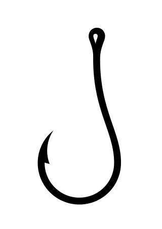

# Event Emitting and Middleware Hooks

[](https://github.com/jaredwray/hookified/actions/workflows/tests.yaml)
[](https://github.com/jaredwray/hookified/blob/master/LICENSE)
[](https://codecov.io/gh/jaredwray/hookified)
[](https://npmjs.com/package/hookified)
[](https://www.jsdelivr.com/package/npm/hookified)
[](https://npmjs.com/package/hookified)

# Features
- Simple replacement for EventEmitter
- Async / Sync Middleware Hooks for Your Methods 
- ESM / CJS with Types and Nodejs 20+
- Browser Support and Delivered via CDN
- Ability to throw errors in hooks
- Ability to pass in a logger (such as Pino) for errors
- Enforce consistent hook naming conventions with `enforceBeforeAfter`
- Deprecation warnings for hooks with `deprecatedHooks`
- Control deprecated hook execution with `allowDeprecated`
- WaterfallHook for sequential data transformation pipelines
- No package dependencies and only 250KB in size
- Fast and Efficient with [Benchmarks](#benchmarks)
- Maintained on a regular basis!

# Table of Contents
- [Installation](#installation)
- [Usage](#usage)
- [Migrating from v1 to v2](#migrating-from-v1-to-v2)
- [Using it in the Browser](#using-it-in-the-browser)
- [Hooks](#hooks)
  - [Standard Hook](#standard-hook)
  - [Waterfall Hook](#waterfallhook)
- [API - Hooks](#api---hooks)
  - [.allowDeprecated](#allowdeprecated)
  - [.deprecatedHooks](#deprecatedhooks)
  - [.enforceBeforeAfter](#enforcebeforeafter)
  - [.eventLogger](#eventlogger)
  - [.hooks](#hooks-1)
  - [.throwOnHookError](#throwOnHookError)
  - [.useHookClone](#usehookclone)
  - [.addHook(event, handler)](#addhookevent-handler)
  - [.afterHook(eventName, ...args)](#afterhookeventname-args)
  - [.beforeHook(eventName, ...args)](#beforehookeventname-args)
  - [.callHook(eventName, ...args)](#callhookeventname-args)
  - [.clearHooks()](#clearhooks)
  - [.getHook(id)](#gethookid)
  - [.getHooks(eventName)](#gethookseventname)
  - [.hook(eventName, ...args)](#hookeventname-args)
  - [.hookSync(eventName, ...args)](#hooksync-eventname-args)
  - [.onHook(hook, options?)](#onhookhook-options)
  - [.onHooks(Array, options?)](#onhooksarray-options)
  - [.onceHook(hook)](#oncehookhook)
  - [.prependHook(hook, options?)](#prependhookhook-options)
  - [.prependOnceHook(hook, options?)](#prependoncehookhook-options)
  - [.removeEventHooks(eventName)](#removeeventhookseventname)
  - [.removeHook(hook)](#removehookhook)
  - [.removeHookById(id)](#removehookbyidid)
  - [.removeHooks(Array)](#removehooksarray)
- [API - Events](#api---events)
  - [.throwOnEmitError](#throwonemitterror)
  - [.throwOnEmptyListeners](#throwonemptylisteners)
  - [.on(eventName, handler)](#oneventname-handler)
  - [.off(eventName, handler)](#offeventname-handler)
  - [.emit(eventName, ...args)](#emiteventname-args)
  - [.listeners(eventName)](#listenerseventname)
  - [.removeAllListeners(eventName)](#removealllistenerseventname)
  - [.setMaxListeners(maxListeners: number)](#setmaxlistenersmaxlisteners-number)
  - [.once(eventName, handler)](#oneventname-handler-1)
  - [.prependListener(eventName, handler)](#prependlistenereventname-handler)
  - [.prependOnceListener(eventName, handler)](#prependoncelistenereventname-handler)
  - [.eventNames()](#eventnames)
  - [.listenerCount(eventName?)](#listenercounteventname)
  - [.rawListeners(eventName?)](#rawlistenerseventname)
- [Logging](#logging)
- [Benchmarks](#benchmarks)
- [How to Contribute](#how-to-contribute)
- [License and Copyright](#license-and-copyright)

# Installation
```bash
npm install hookified --save
```

# Usage
This was built because we constantly wanted hooks and events extended on libraires we are building such as [Keyv](https://keyv.org) and [Cacheable](https://cacheable.org). This is a simple way to add hooks and events to your classes.

```javascript
import { Hookified } from 'hookified';

class MyClass extends Hookified {
  constructor() {
    super();
  }

  async myMethodEmittingEvent() {
    this.emit('message', 'Hello World');
  }

  //with hooks you can pass data in and if they are subscribed via onHook they can modify the data
  async myMethodWithHooks(): Promise<any> {
    let data = { some: 'data' };
    // do something
    await this.hook('before:myMethod2', data);

    return data;
  }
}
```

You can even pass in multiple arguments to the hooks:

```javascript
import { Hookified } from 'hookified';

class MyClass extends Hookified {
  constructor() {
    super();
  }

  async myMethodWithHooks(): Promise<any> {
    let data = { some: 'data' };
    let data2 = { some: 'data2' };
    // do something
    await this.hook('before:myMethod2', data, data2);

    return data;
  }
}
```

# Using it in the Browser

```html
<script type="module">
  import { Hookified } from 'https://cdn.jsdelivr.net/npm/hookified/dist/browser/index.js';

  class MyClass extends Hookified {
    constructor() {
      super();
    }

    async myMethodEmittingEvent() {
      this.emit('message', 'Hello World');
    }

    //with hooks you can pass data in and if they are subscribed via onHook they can modify the data
    async myMethodWithHooks(): Promise<any> {
      let data = { some: 'data' };
      // do something
      await this.hook('before:myMethod2', data);

      return data;
    }
  }
</script>
```

if you are not using ESM modules, you can use the following:

```html
<script src="https://cdn.jsdelivr.net/npm/hookified/dist/browser/index.global.js"></script>
<script>
  class MyClass extends Hookified {
    constructor() {
      super();
    }

    async myMethodEmittingEvent() {
      this.emit('message', 'Hello World');
    }

    //with hooks you can pass data in and if they are subscribed via onHook they can modify the data
    async myMethodWithHooks(): Promise<any> {
      let data = { some: 'data' };
      // do something
      await this.hook('before:myMethod2', data);

      return data;
    }
  }
</script>
```

# Hooks

## Standard Hook

The `Hook` class provides a convenient way to create hook entries. It implements the `IHook` interface.

The `IHook` interface has the following properties:

| Property | Type | Required | Description |
|----------|------|----------|-------------|
| `id` | `string` | No | Unique identifier for the hook. Auto-generated via `crypto.randomUUID()` if not provided. |
| `event` | `string` | Yes | The event name for the hook. |
| `handler` | `HookFn` | Yes | The handler function for the hook. |

When a hook is registered, it is assigned an `id` (auto-generated if not provided). The `id` can be used to look up or remove hooks via `getHook` and `removeHookById`. If you register a hook with the same `id` on the same event, it will replace the existing hook in-place (preserving its position).

**Using the `Hook` class:**

```javascript
import { Hook, Hookified } from 'hookified';

class MyClass extends Hookified {
  constructor() { super(); }
}

const myClass = new MyClass();

// Without id (auto-generated)
const hook = new Hook('before:save', async (data) => {
  data.validated = true;
});

// With id
const hook2 = new Hook('after:save', async (data) => {
  console.log('saved');
}, 'my-after-save-hook');

// Register with onHook
myClass.onHook(hook);

// Or register multiple hooks with onHooks
const hooks = [
  new Hook('before:save', async (data) => { data.validated = true; }),
  new Hook('after:save', async (data) => { console.log('saved'); }),
];
myClass.onHooks(hooks);

// Remove hooks
myClass.removeHooks(hooks);
```

**Using plain TypeScript with the `IHook` interface:**

```typescript
import { Hookified, type IHook } from 'hookified';

class MyClass extends Hookified {
  constructor() { super(); }
}

const myClass = new MyClass();

const hook: IHook = {
  id: 'my-validation-hook', // optional — auto-generated if omitted
  event: 'before:save',
  handler: async (data) => {
    data.validated = true;
  },
};

const stored = myClass.onHook(hook);
console.log(stored?.id); // 'my-validation-hook'

// Later, remove by id
myClass.removeHookById('my-validation-hook');
```

## Waterfall Hook

The `WaterfallHook` class chains multiple hook functions sequentially in a waterfall pipeline. Each hook receives a context containing the original arguments and the accumulated results from all previous hooks. It implements the `IHook` interface, so it integrates directly with `Hookified.onHook()`.

The `WaterfallHookContext` has the following properties:

| Property | Type | Description |
|----------|------|-------------|
| `initialArgs` | `any` | The original arguments passed to the waterfall execution. |
| `results` | `WaterfallHookResult[]` | Array of `{ hook, result }` entries from previous hooks. Empty for the first hook. |

**Basic usage:**

```javascript
import { WaterfallHook } from 'hookified';

const wh = new WaterfallHook('process', ({ results, initialArgs }) => {
  // Final handler receives all accumulated results
  const lastResult = results[results.length - 1].result;
  console.log('Final:', lastResult);
});

// Add transformation hooks to the pipeline
wh.addHook(({ initialArgs }) => {
  return initialArgs + 1; // 5 -> 6
});

wh.addHook(({ results }) => {
  return results[results.length - 1].result * 2; // 6 -> 12
});

// Execute the waterfall by calling handler directly
await wh.handler(5); // Final: 12
```

**Integrating with Hookified via `onHook()`:**

```javascript
import { Hookified, WaterfallHook } from 'hookified';

class MyClass extends Hookified {
  constructor() { super(); }
}

const myClass = new MyClass();

const wh = new WaterfallHook('save', ({ results }) => {
  const data = results[results.length - 1].result;
  console.log('Saved:', data);
});

wh.addHook(({ initialArgs }) => {
  return { ...initialArgs, validated: true };
});

wh.addHook(({ results }) => {
  return { ...results[results.length - 1].result, timestamp: Date.now() };
});

// Register with Hookified — works because WaterfallHook implements IHook
myClass.onHook(wh);

// When hook() fires, the full waterfall pipeline executes
await myClass.hook('save', { name: 'test' });
// Saved: { name: 'test', validated: true, timestamp: ... }
```

**Managing hooks:**

```javascript
const wh = new WaterfallHook('process', ({ results }) => results);

const myHook = ({ initialArgs }) => initialArgs + 1;
wh.addHook(myHook);

// Remove a hook by reference
wh.removeHook(myHook); // returns true

// Access the hooks array
console.log(wh.hooks.length); // 0
```

# API - Hooks

> All examples below assume the following setup unless otherwise noted:
> ```javascript
> import { Hookified } from 'hookified';
> class MyClass extends Hookified {
>   constructor(options) { super(options); }
> }
> const myClass = new MyClass();
> ```

## .allowDeprecated

Controls whether deprecated hooks are allowed to be registered and executed. Default is true. When set to false, deprecated hooks will still emit warnings but will be prevented from registration and execution.

```javascript
import { Hookified } from 'hookified';

const deprecatedHooks = new Map([
  ['oldHook', 'Use newHook instead']
]);

class MyClass extends Hookified {
  constructor() {
    super({ deprecatedHooks, allowDeprecated: false });
  }
}

const myClass = new MyClass();

console.log(myClass.allowDeprecated); // false

// Listen for deprecation warnings (still emitted even when blocked)
myClass.on('warn', (event) => {
  console.log(`Warning: ${event.message}`);
});

// Try to register a deprecated hook - will emit warning but not register
myClass.onHook({ event: 'oldHook', handler: () => {
  console.log('This will never execute');
}});
// Output: Warning: Hook "oldHook" is deprecated: Use newHook instead

// Verify hook was not registered
console.log(myClass.getHooks('oldHook')); // undefined

// Try to execute a deprecated hook - will emit warning but not execute
await myClass.hook('oldHook');
// Output: Warning: Hook "oldHook" is deprecated: Use newHook instead
// (but no handlers execute)

// Non-deprecated hooks work normally
myClass.onHook({ event: 'validHook', handler: () => {
  console.log('This works fine');
}});

console.log(myClass.getHooks('validHook')); // [handler function]

// You can dynamically change the setting
myClass.allowDeprecated = true;

// Now deprecated hooks can be registered and executed
myClass.onHook({ event: 'oldHook', handler: () => {
  console.log('Now this works');
}});

console.log(myClass.getHooks('oldHook')); // [handler function]
```

**Behavior when `allowDeprecated` is false:**
- **Registration**: All hook registration methods (`onHook`, `addHook`, `prependHook`, etc.) will emit warnings but skip registration
- **Execution**: Hook execution methods (`hook`, `callHook`) will emit warnings but skip execution
- **Removal/Reading**: `removeHook`, `removeHooks`, and `getHooks` always work regardless of deprecation status
- **Warnings**: Deprecation warnings are always emitted regardless of `allowDeprecated` setting

**Use cases:**
- **Development**: Keep `allowDeprecated: true` to maintain functionality while seeing warnings
- **Testing**: Set `allowDeprecated: false` to ensure no deprecated hooks are accidentally used
- **Migration**: Gradually disable deprecated hooks during API transitions
- **Production**: Disable deprecated hooks to prevent legacy code execution

## .deprecatedHooks

A Map of deprecated hook names to deprecation messages. When a deprecated hook is used, a warning will be emitted via the 'warn' event and logged to the logger (if available). Default is an empty Map.

```javascript
import { Hookified } from 'hookified';

// Define deprecated hooks with custom messages
const deprecatedHooks = new Map([
  ['oldHook', 'Use newHook instead'],
  ['legacyMethod', 'This hook will be removed in v2.0'],
  ['deprecatedFeature', ''] // Empty message - will just say "deprecated"
]);

class MyClass extends Hookified {
  constructor() {
    super({ deprecatedHooks });
  }
}

const myClass = new MyClass();

console.log(myClass.deprecatedHooks); // Map with deprecated hooks

// Listen for deprecation warnings
myClass.on('warn', (event) => {
  console.log(`Deprecation warning: ${event.message}`);
  // event.hook contains the hook name
  // event.message contains the full warning message
});

// Using a deprecated hook will emit warnings
myClass.onHook({ event: 'oldHook', handler: () => {
  console.log('This hook is deprecated');
}});
// Output: Hook "oldHook" is deprecated: Use newHook instead

// Using a deprecated hook with empty message
myClass.onHook({ event: 'deprecatedFeature', handler: () => {
  console.log('This hook is deprecated');
}});
// Output: Hook "deprecatedFeature" is deprecated

// You can also set deprecated hooks dynamically
myClass.deprecatedHooks.set('anotherOldHook', 'Please migrate to the new API');

// Works with logger if provided
import pino from 'pino';
const logger = pino();

const myClassWithLogger = new Hookified({
  deprecatedHooks,
  eventLogger: logger
});

// Deprecation warnings will be logged to logger.warn
```

The deprecation warning system applies to the following hook-related methods:
- Registration: `onHook()`, `addHook()`, `onHooks()`, `prependHook()`, `onceHook()`, `prependOnceHook()`
- Execution: `hook()`, `callHook()`

Note: `getHooks()`, `removeHook()`, and `removeHooks()` do not check for deprecated hooks and always operate normally.

Deprecation warnings are emitted in two ways:
1. **Event**: A 'warn' event is emitted with `{ hook: string, message: string }`
2. **Logger**: Logged to `eventLogger.warn()` if an `eventLogger` is configured and has a `warn` method

## .enforceBeforeAfter

If set to true, enforces that all hook names must start with 'before' or 'after'. This is useful for maintaining consistent hook naming conventions in your application. Default is false.

```javascript
import { Hookified } from 'hookified';

class MyClass extends Hookified {
  constructor() {
    super({ enforceBeforeAfter: true });
  }
}

const myClass = new MyClass();

console.log(myClass.enforceBeforeAfter); // true

// These will work fine
myClass.onHook({ event: 'beforeSave', handler: async () => {
  console.log('Before save hook');
}});

myClass.onHook({ event: 'afterSave', handler: async () => {
  console.log('After save hook');
}});

myClass.onHook({ event: 'before:validation', handler: async () => {
  console.log('Before validation hook');
}});

// This will throw an error
try {
  myClass.onHook({ event: 'customEvent', handler: async () => {
    console.log('This will not work');
  }});
} catch (error) {
  console.log(error.message); // Hook event "customEvent" must start with "before" or "after" when enforceBeforeAfter is enabled
}

// You can also change it dynamically
myClass.enforceBeforeAfter = false;
myClass.onHook({ event: 'customEvent', handler: async () => {
  console.log('This will work now');
}});
```

The validation applies to all hook-related methods:
- `onHook()`, `addHook()`, `onHooks()`
- `prependHook()`, `onceHook()`, `prependOnceHook()`
- `hook()`, `callHook()`
- `getHooks()`, `removeHook()`, `removeHooks()`

Note: The `beforeHook()` and `afterHook()` helper methods automatically generate proper hook names and work regardless of the `enforceBeforeAfter` setting.

## .eventLogger
If set, errors thrown in hooks will be logged to the logger. If not set, errors will be only emitted.

```javascript
import pino from 'pino';

const myClass = new MyClass({ eventLogger: pino() });

myClass.onHook({ event: 'before:myMethod2', handler: async () => {
  throw new Error('error');
}});

// when you call before:myMethod2 it will log the error to the logger
await myClass.hook('before:myMethod2');
```

## .hooks

Get all hooks. Returns a `Map<string, IHook[]>` where each key is an event name and the value is an array of `IHook` objects.

```javascript
myClass.onHook({ event: 'before:myMethod2', handler: async (data) => {
  data.some = 'new data';
}});

console.log(myClass.hooks); // Map { 'before:myMethod2' => [{ event: 'before:myMethod2', handler: [Function] }] }
```

## .throwOnHookError

If set to true, errors thrown in hooks will be thrown. If set to false, errors will be only emitted.

```javascript
const myClass = new MyClass({ throwOnHookError: true });

console.log(myClass.throwOnHookError); // true

try {
  myClass.onHook({ event: 'error-event', handler: async () => {
    throw new Error('error');
  }});

  await myClass.hook('error-event');
} catch (error) {
  console.log(error.message); // error
}

myClass.throwOnHookError = false;
console.log(myClass.throwOnHookError); // false
```

## .useHookClone

Controls whether hook objects are cloned before storing internally. Default is `true`. When `true`, a shallow copy of the `IHook` object is stored, preventing external mutation from affecting registered hooks. When `false`, the original reference is stored directly.

```javascript
const myClass = new MyClass({ useHookClone: false });

const hook = { event: 'before:save', handler: async (data) => {} };
myClass.onHook(hook);

// With useHookClone: false, the stored hook is the same reference
const storedHooks = myClass.getHooks('before:save');
console.log(storedHooks[0] === hook); // true

// You can dynamically change the setting
myClass.useHookClone = true;
```

## .addHook(event, handler)

This is an alias for `.onHook()` that takes an event name and handler function directly.

```javascript
myClass.addHook('before:myMethod2', async (data) => {
  data.some = 'new data';
});
```

## .afterHook(eventName, ...args)

This is a helper function that will prepend a hook name with `after:`.

```javascript
// Inside your class method — the event name will be `after:myMethod2`
await this.afterHook('myMethod2', data);
```

## .beforeHook(eventName, ...args)

This is a helper function that will prepend a hook name with `before:`.

```javascript
// Inside your class method — the event name will be `before:myMethod2`
await this.beforeHook('myMethod2', data);
```

## .callHook(eventName, ...args)

This is an alias for `.hook(eventName, ...args)` for backwards compatibility.

## .clearHooks()

Clear all hooks across all events.

```javascript
myClass.onHook({ event: 'before:myMethod2', handler: async (data) => {
  data.some = 'new data';
}});

myClass.clearHooks();
```

## .getHook(id)

Get a specific hook by `id`, searching across all events. Returns the `IHook` if found, or `undefined`.

```javascript
const myClass = new MyClass();

myClass.onHook({
  id: 'my-hook',
  event: 'before:save',
  handler: async (data) => { data.validated = true; },
});

const hook = myClass.getHook('my-hook');
console.log(hook?.id); // 'my-hook'
console.log(hook?.event); // 'before:save'
console.log(hook?.handler); // [Function]
```

## .getHooks(eventName)

Get all hooks for an event. Returns an `IHook[]` array, or `undefined` if no hooks are registered for the event.

```javascript
myClass.onHook({ event: 'before:myMethod2', handler: async (data) => {
  data.some = 'new data';
}});

console.log(myClass.getHooks('before:myMethod2')); // [{ event: 'before:myMethod2', handler: [Function] }]
```

## .hook(eventName, ...args)

Run a hook event.

```javascript
// Inside your class method
await this.hook('before:myMethod2', data);
```

You can pass multiple arguments to the hook:

```javascript
// Inside your class method
await this.hook('before:myMethod2', data, data2);

// The handler receives all arguments
myClass.onHook({ event: 'before:myMethod2', handler: async (data, data2) => {
  data.some = 'new data';
  data2.some = 'new data2';
}});
```

## .hookSync(eventName, ...args)

Run a hook event synchronously. Async handlers (functions declared with `async` keyword) are silently skipped and only synchronous handlers are executed.

> **Note:** The `.hook()` method is preferred as it executes both sync and async functions. Use `.hookSync()` only when you specifically need synchronous execution.

```javascript
// This sync handler will execute
myClass.onHook({ event: 'before:myMethod', handler: (data) => {
  data.some = 'modified';
}});

// This async handler will be silently skipped
myClass.onHook({ event: 'before:myMethod', handler: async (data) => {
  data.some = 'will not run';
}});

// Inside your class method
this.hookSync('before:myMethod', data); // Only sync handler runs
```

## .onHook(hook, options?) / .onHook(event, handler)

Subscribe to a hook event. Supports two calling styles:

- **Object form**: `onHook(hook, options?)` — takes an `IHook` object and an optional `OnHookOptions` object.
- **Shorthand form**: `onHook(event, handler)` — takes an event name string and a handler function (v1-compatible).

Returns the stored `IHook` (with `id` assigned), or `undefined` if the hook was blocked by deprecation. The returned reference is the exact object stored internally, which is useful for later removal with `.removeHook()` or `.removeHookById()`. To register multiple hooks at once, use `.onHooks()`.

If the hook has an `id`, it will be used as-is. If not, a UUID is auto-generated via `crypto.randomUUID()`. If a hook with the same `id` already exists on the same event, it will be **replaced in-place** (preserving its position in the array).

**Options (`OnHookOptions`)**:
- `useHookClone` (boolean, optional) — Per-call override for the instance-level `useHookClone` setting. When `true`, the hook object is cloned before storing. When `false`, the original reference is stored directly. When omitted, falls back to the instance-level setting.
- `position` (`"Top"` | `"Bottom"` | `number`, optional) — Controls where the hook is inserted in the handlers array. `"Top"` inserts at the beginning, `"Bottom"` appends to the end (default). A number inserts at that index, clamped to the array bounds.

```javascript
// Single hook — returns the stored IHook with id
const stored = myClass.onHook({
  event: 'before:myMethod2',
  handler: async (data) => {
    data.some = 'new data';
  },
});
console.log(stored.id); // auto-generated UUID

// With a custom id
const stored2 = myClass.onHook({
  id: 'my-validation',
  event: 'before:save',
  handler: async (data) => { data.validated = true; },
});

// Replace hook by registering with the same id
myClass.onHook({
  id: 'my-validation',
  event: 'before:save',
  handler: async (data) => { data.validated = true; data.extra = true; },
});
// Only one hook with id 'my-validation' exists, at the same position

// Remove by id
myClass.removeHookById('my-validation');

// Use the returned reference to remove the hook later
myClass.removeHook(stored);

// Override useHookClone per-call — store original reference even though instance default is true
const hook = { event: 'before:save', handler: async (data) => {} };
myClass.onHook(hook, { useHookClone: false });
console.log(myClass.getHooks('before:save')[0] === hook); // true

// Insert at the top of the handlers array
myClass.onHook({ event: 'before:save', handler: async (data) => {} }, { position: 'Top' });

// Insert at a specific index
myClass.onHook({ event: 'before:save', handler: async (data) => {} }, { position: 1 });

// Shorthand form — pass event name and handler directly (v1-compatible)
myClass.onHook('before:save', async (data) => {
  data.validated = true;
});
```

## .onHooks(Array, options?)

Subscribe to multiple hook events at once. Takes an array of `IHook` objects and an optional `OnHookOptions` object that is applied to each hook.

```javascript
const hooks = [
  {
    event: 'before:myMethodWithHooks',
    handler: async (data) => {
      data.some = 'new data1';
    },
  },
  {
    event: 'after:myMethodWithHooks',
    handler: async (data) => {
      data.some = 'new data2';
    },
  },
];
myClass.onHooks(hooks);

// With options — insert all hooks at the top
myClass.onHooks(hooks, { position: 'Top' });

// With options — skip cloning for all hooks in this batch
myClass.onHooks(hooks, { useHookClone: false });
```

## .onceHook(hook)

Subscribe to a hook event once. Takes an `IHook` object with `event` and `handler` properties. After the handler is called once, it is automatically removed.

```javascript
myClass.onceHook({ event: 'before:myMethod2', handler: async (data) => {
  data.some = 'new data';
}});

await myClass.hook('before:myMethod2', data); // handler runs once then is removed
console.log(myClass.hooks.size); // 0
```

## .prependHook(hook, options?)

Subscribe to a hook event before all other hooks. Takes an `IHook` object with `event` and `handler` properties. Returns the stored `IHook` (with generated `id`), or `undefined` if blocked by deprecation. Equivalent to calling `onHook(hook, { position: "Top" })`.

An optional `PrependHookOptions` object can be passed with:
- `useHookClone` (boolean) — per-call override for hook cloning behavior

```javascript
myClass.onHook({ event: 'before:myMethod2', handler: async (data) => {
  data.some = 'new data';
}});
myClass.prependHook({ event: 'before:myMethod2', handler: async (data) => {
  data.some = 'will run before new data';
}});
```

## .prependOnceHook(hook, options?)

Subscribe to a hook event before all other hooks. Takes an `IHook` object with `event` and `handler` properties. After the handler is called once, it is automatically removed. Returns the stored `IHook` (with generated `id`), or `undefined` if blocked by deprecation.

An optional `PrependHookOptions` object can be passed with:
- `useHookClone` (boolean) — per-call override for hook cloning behavior

```javascript
myClass.onHook({ event: 'before:myMethod2', handler: async (data) => {
  data.some = 'new data';
}});
myClass.prependOnceHook({ event: 'before:myMethod2', handler: async (data) => {
  data.some = 'will run before new data';
}});
```

## .removeEventHooks(eventName)

Removes all hooks for a specific event and returns the removed hooks as an `IHook[]` array. Returns an empty array if no hooks are registered for the event.

```javascript
myClass.onHook({ event: 'before:myMethod2', handler: async (data) => {
  data.some = 'new data';
}});
myClass.onHook({ event: 'before:myMethod2', handler: async (data) => {
  data.some = 'more data';
}});

// Remove all hooks for a specific event
const removed = myClass.removeEventHooks('before:myMethod2');
console.log(removed.length); // 2
```

## .removeHook(hook)

Unsubscribe a handler from a hook event. Takes an `IHook` object with `event` and `handler` properties. Returns the removed hook as an `IHook` object, or `undefined` if the handler was not found.

```javascript
const handler = async (data) => {
  data.some = 'new data';
};

myClass.onHook({ event: 'before:myMethod2', handler });

const removed = myClass.removeHook({ event: 'before:myMethod2', handler });
console.log(removed); // { event: 'before:myMethod2', handler: [Function] }
```

## .removeHookById(id)

Remove one or more hooks by `id`, searching across all events. Accepts a single `string` or an array of `string` ids.

- **Single id**: Returns the removed `IHook`, or `undefined` if not found.
- **Array of ids**: Returns an `IHook[]` array of the hooks that were successfully removed.

When the last hook for an event is removed, the event key is cleaned up.

```javascript
const myClass = new MyClass();

myClass.onHook({ id: 'hook-a', event: 'before:save', handler: async () => {} });
myClass.onHook({ id: 'hook-b', event: 'after:save', handler: async () => {} });
myClass.onHook({ id: 'hook-c', event: 'before:save', handler: async () => {} });

// Remove a single hook by id
const removed = myClass.removeHookById('hook-a');
console.log(removed?.id); // 'hook-a'

// Remove multiple hooks by ids
const removedMany = myClass.removeHookById(['hook-b', 'hook-c']);
console.log(removedMany.length); // 2
```

## .removeHooks(Array)

Unsubscribe from multiple hooks. Returns an array of the hooks that were successfully removed.

```javascript
const hooks = [
  { event: 'before:save', handler: async (data) => { data.some = 'new data1'; } },
  { event: 'after:save', handler: async (data) => { data.some = 'new data2'; } },
];
myClass.onHooks(hooks);

const removed = myClass.removeHooks(hooks);
console.log(removed.length); // 2
```

# API - Events

> All examples below assume the following setup unless otherwise noted:
> ```javascript
> import { Hookified } from 'hookified';
> class MyClass extends Hookified {
>   constructor(options) { super(options); }
> }
> const myClass = new MyClass();
> ```

## .throwOnEmitError

If set to true, errors emitted as `error` will always be thrown, even if there are listeners. If set to false (default), errors will only be emitted to listeners.

```javascript
const myClass = new MyClass({ throwOnEmitError: true });

myClass.on('error', (err) => {
  console.log('listener received:', err.message);
});

try {
  myClass.emit('error', new Error('This will throw despite having a listener'));
} catch (error) {
  console.log(error.message); // This will throw despite having a listener
}
```

## .throwOnEmptyListeners

If set to true, errors will be thrown when emitting an `error` event with no listeners. This follows the standard Node.js EventEmitter behavior. Default is `true`.

```javascript
const myClass = new MyClass({ throwOnEmptyListeners: true });

console.log(myClass.throwOnEmptyListeners); // true (default)

// This will throw because there are no error listeners
try {
  myClass.emit('error', new Error('Something went wrong'));
} catch (error) {
  console.log(error.message); // Something went wrong
}

// Add an error listener - now it won't throw
myClass.on('error', (error) => {
  console.log('Error caught:', error.message);
});

myClass.emit('error', new Error('This will be caught')); // No throw, listener handles it

// You can also change it dynamically
myClass.throwOnEmptyListeners = false;
console.log(myClass.throwOnEmptyListeners); // false
```

**Difference between `throwOnEmitError` and `throwOnEmptyListeners`:**
- `throwOnEmitError`: Throws when emitting 'error' event every time.
- `throwOnEmptyListeners`: Throws only when there are NO error listeners registered

When both are set to `true`, `throwOnEmitError` takes precedence.

## .on(eventName, handler)

Subscribe to an event.

```javascript
myClass.on('message', (message) => {
  console.log(message);
});
```

## .off(eventName, handler)

Unsubscribe from an event.

```javascript
const handler = (message) => {
  console.log(message);
};

myClass.on('message', handler);
myClass.off('message', handler);
```

## .emit(eventName, ...args)

Emit an event.

```javascript
myClass.emit('message', 'Hello World');
```

## .listeners(eventName)

Get all listeners for an event.

```javascript
myClass.on('message', (message) => {
  console.log(message);
});

console.log(myClass.listeners('message'));
```

## .removeAllListeners(eventName)

Remove all listeners for an event.

```javascript
myClass.on('message', (message) => {
  console.log(message);
});

myClass.removeAllListeners('message');
```

## .setMaxListeners(maxListeners: number)

Set the maximum number of listeners for a single event. Default is `0` (unlimited). Negative values are treated as `0`. Setting to `0` disables the limit and the warning. When the limit is exceeded, a `MaxListenersExceededWarning` is emitted via `console.warn` but the listener is still added. This matches standard Node.js EventEmitter behavior.

```javascript
myClass.setMaxListeners(1);

myClass.on('message', (message) => {
  console.log(message);
});

myClass.on('message', (message) => {
  console.log(message);
}); // warning emitted but listener is still added

console.log(myClass.listenerCount('message')); // 2
```

## .once(eventName, handler)

Subscribe to an event once.

```javascript
myClass.once('message', (message) => {
  console.log(message);
});

myClass.emit('message', 'Hello World'); // handler runs
myClass.emit('message', 'Hello World'); // handler does not run
```

## .prependListener(eventName, handler)

Prepend a listener to an event. This will be called before any other listeners.

```javascript
myClass.prependListener('message', (message) => {
  console.log(message);
});
```

## .prependOnceListener(eventName, handler)

Prepend a listener to an event once. This will be called before any other listeners.

```javascript
myClass.prependOnceListener('message', (message) => {
  console.log(message);
});

myClass.emit('message', 'Hello World');
```

## .eventNames()

Get all event names.

```javascript
myClass.on('message', (message) => {
  console.log(message);
});

console.log(myClass.eventNames()); // ['message']
```

## .listenerCount(eventName?)

Get the count of listeners for an event or all events if eventName not provided.

```javascript
myClass.on('message', (message) => {
  console.log(message);
});

console.log(myClass.listenerCount('message')); // 1
```

## .rawListeners(eventName?)

Get all listeners for an event or all events if eventName not provided.

```javascript
myClass.on('message', (message) => {
  console.log(message);
});

console.log(myClass.rawListeners('message'));
```

# Logging

Hookified integrates logging directly into the event system. When an `eventLogger` is configured, all emitted events are automatically logged to the appropriate log level based on the event name.

## How It Works

When you emit an event, Hookified automatically sends the event data to the configured `eventLogger` using the appropriate log method:

| Event Name | Logger Method |
|------------|---------------|
| `error`    | `eventLogger.error()` |
| `warn`     | `eventLogger.warn()` |
| `debug`    | `eventLogger.debug()` |
| `trace`    | `eventLogger.trace()` |
| `fatal`    | `eventLogger.fatal()` |
| Any other  | `eventLogger.info()` |

The logger receives two arguments:
1. **message**: A string extracted from the event data (error messages, object messages, or JSON stringified data)
2. **context**: An object containing `{ event: eventName, data: originalData }`

## Setting Up a Logger

Any logger that implements the `Logger` interface is compatible. This includes popular loggers like [Pino](https://github.com/pinojs/pino), [Winston](https://github.com/winstonjs/winston), [Bunyan](https://github.com/trentm/node-bunyan), and others.

```typescript
type Logger = {
  trace: (message: string, ...args: unknown[]) => void;
  debug: (message: string, ...args: unknown[]) => void;
  info: (message: string, ...args: unknown[]) => void;
  warn: (message: string, ...args: unknown[]) => void;
  error: (message: string, ...args: unknown[]) => void;
  fatal: (message: string, ...args: unknown[]) => void;
};
```

## Usage Example with Pino

```javascript
import { Hookified } from 'hookified';
import pino from 'pino';

const logger = pino();

class MyService extends Hookified {
  constructor() {
    super({ eventLogger: logger });
  }

  async processData(data) {
    // This will log to logger.info with the data
    this.emit('info', { action: 'processing', data });

    try {
      // ... process data
      this.emit('debug', { action: 'completed', result: 'success' });
    } catch (err) {
      // This will log to logger.error with the error message
      this.emit('error', err);
    }
  }
}

const service = new MyService();

// All events are automatically logged
service.emit('info', 'Service started');        // -> logger.info()
service.emit('warn', { message: 'Low memory' }); // -> logger.warn()
service.emit('error', new Error('Failed'));      // -> logger.error()
service.emit('custom-event', { foo: 'bar' });    // -> logger.info() (default)
```

You can also set or change the eventLogger after instantiation:

```javascript
const service = new MyService();
service.eventLogger = pino({ level: 'debug' });

// Or remove the eventLogger
service.eventLogger = undefined;
```

# Benchmarks

We are doing very simple benchmarking to see how this compares to other libraries using `tinybench`. This is not a full benchmark but just a simple way to see how it performs.

## Hooks

|         name         |  summary  |  ops/sec  |  time/op  |  margin  |  samples  |
|----------------------|:---------:|----------:|----------:|:--------:|----------:|
|  Hookified (v2.0.1)  |    🥇     |       5M  |    221ns  |  ±0.01%  |       5M  |
|  Hookable (v6.0.1)   |   -59%    |       2M  |    569ns  |  ±0.01%  |       2M  |

## Emits

This shows how on par `hookified` is to the native `EventEmitter` and popular `eventemitter3`. These are simple emitting benchmarks to see how it performs. Our goal is to be as close or better than the other libraries including native (EventEmitter).

|           name            |  summary  |  ops/sec  |  time/op  |  margin  |  samples  |
|---------------------------|:---------:|----------:|----------:|:--------:|----------:|
|  Hookified (v2.0.1)       |    🥇     |      12M  |     93ns  |  ±0.01%  |      11M  |
|  EventEmitter3 (v5.0.4)   |   -2.4%   |      12M  |     91ns  |  ±0.01%  |      11M  |
|  EventEmitter (v24.11.1)  |   -2.6%   |      12M  |     90ns  |  ±0.01%  |      11M  |
|  Emittery (v1.2.0)        |   -91%    |       1M  |      1µs  |  ±0.01%  |     990K  |

_Note: the `EventEmitter` version is Nodejs versioning._

# Migrating from v1 to v2

## Quick Guide

v2 overhauls hook storage to use `IHook` objects instead of raw functions. This enables hook IDs, ordering via position, cloning control, and new hook types like `WaterfallHook`. `onHook` now supports both the v1 positional `(event, handler)` form and the new `IHook` object form, so this is **not a breaking change**:

```typescript
// v1 style — still works
hookified.onHook('before:save', async (data) => {});

// v2 style — IHook object with options support
hookified.onHook({ event: 'before:save', handler: async (data) => {} });

// addHook also works as an alias for the positional form
hookified.addHook('before:save', async (data) => {});
```

**Other common changes:**

| v1 | v2 |
|---|---|
| `throwHookErrors` | `throwOnHookError` |
| `logger` | `eventLogger` |
| `onHookEntry(hook)` | `onHook(hook)` |
| `HookEntry` type | `IHook` interface |
| `Hook` type (fn) | `HookFn` type |
| `getHooks()` returns `HookFn[]` | `getHooks()` returns `IHook[]` |
| `removeHook(event, handler)` | `removeHook({ event, handler })` |

See below for full details on each change.

**[Breaking Changes](#breaking-changes)**
- [`throwHookErrors` removed — use `throwOnHookError` instead](#throwhookerrors-removed--use-throwonhookerror-instead)
- [`throwOnEmptyListeners` now defaults to `true`](#throwonemptylisteners-now-defaults-to-true)
- [`logger` renamed to `eventLogger`](#logger-renamed-to-eventlogger)
- [`maxListeners` default changed from `100` to `0` (unlimited) and no longer truncates](#maxlisteners-default-changed-from-100-to-0-unlimited-and-no-longer-truncates)
- [`onHookEntry` removed — use `onHook` instead](#onhookentry-removed--use-onhook-instead)
- [`onHook` signature updated (not breaking)](#onhook-signature-updated)
- [`HookEntry` type and `Hook` type removed](#hookentry-type-and-hook-type-removed)
- [`removeHook` and `removeHooks` now return removed hooks](#removehook-and-removehooks-now-return-removed-hooks)
- [`removeHook`, `removeHooks`, and `getHooks` no longer check for deprecated hooks](#removehook-removehooks-and-gethooks-no-longer-check-for-deprecated-hooks)
- [Internal hook storage now uses `IHook` objects](#internal-hook-storage-now-uses-ihook-objects)
- [`onceHook`, `prependHook`, `prependOnceHook`, and `removeHook` now take `IHook`](#oncehook-prependhook-prependoncehook-and-removehook-now-take-ihook)
- [`onHook` now returns the stored hook](#onhook-now-returns-the-stored-hook)

**[New Features](#new-features)**
- [standard `Hook` class now available](#standard-hook)
- [`WaterfallHook` class for sequential data transformation pipelines](#waterfallhook-class)
- [`useHookClone` option](#usehookclone-option)
- [`onHook` now accepts `OnHookOptions`](#onhook-now-accepts-onhookoptions)
- [`IHook` now has an `id` property](#ihook-now-has-an-id-property)
- [`removeEventHooks` method](#removeeventhooks-method)

## Breaking Changes

| Change | Summary |
|---|---|
| `throwHookErrors` | Renamed to `throwOnHookError` |
| `throwOnEmptyListeners` | Default changed from `false` to `true` |
| `logger` | Renamed to `eventLogger` |
| `maxListeners` | Default changed from `100` to `0` (unlimited), no longer truncates |
| `onHookEntry` | Removed — use `onHook` instead |
| `onHook` signature | Now takes `IHook` object **or** `(event, handler)` — both supported (not breaking) |
| `HookEntry` / `Hook` types | Replaced with `IHook` / `HookFn` |
| `removeHook` / `removeHooks` | Now return removed hooks; no longer check deprecated status |
| Internal hook storage | Uses `IHook` objects instead of raw functions |
| `onceHook`, `prependHook`, etc. | Now take `IHook` instead of `(event, handler)` |
| `onHook` return | Now returns stored `IHook` (was `void`) |

### `throwHookErrors` removed — use `throwOnHookError` instead

The deprecated `throwHookErrors` option and property has been removed. Use `throwOnHookError` instead.

**Before (v1):**

```javascript
super({ throwHookErrors: true });
myClass.throwHookErrors = false;
```

**After (v2):**

```javascript
super({ throwOnHookError: true });
myClass.throwOnHookError = false;
```

### `throwOnEmptyListeners` now defaults to `true`

The `throwOnEmptyListeners` option now defaults to `true`, matching standard Node.js EventEmitter behavior. Previously it defaulted to `false`. If you emit an `error` event with no listeners registered, an error will now be thrown by default.

**Before (v1):**

```javascript
const myClass = new MyClass(); // throwOnEmptyListeners defaults to false
myClass.emit('error', new Error('No throw')); // silently ignored
```

**After (v2):**

```javascript
const myClass = new MyClass(); // throwOnEmptyListeners defaults to true
myClass.emit('error', new Error('This will throw')); // throws!

// To restore v1 behavior:
const myClass2 = new MyClass({ throwOnEmptyListeners: false });
```

### `logger` renamed to `eventLogger`

The `logger` option and property has been renamed to `eventLogger` to avoid conflicts with other logger properties in your classes.

**Before (v1):**

```javascript
super({ logger });
myClass.logger = pino({ level: 'debug' });
```

**After (v2):**

```javascript
super({ eventLogger: logger });
myClass.eventLogger = pino({ level: 'debug' });
```

### `maxListeners` default changed from `100` to `0` (unlimited) and no longer truncates

The default maximum number of listeners has changed from `100` to `0` (unlimited). The `MaxListenersExceededWarning` will no longer be emitted unless you explicitly set a limit via `setMaxListeners()`. Additionally, `setMaxListeners()` no longer truncates existing listeners — it only sets the warning threshold, matching standard Node.js EventEmitter behavior.

**Before (v1):**

```javascript
const myClass = new MyClass(); // maxListeners defaults to 100
// Warning emitted after adding 100+ listeners to the same event
// setMaxListeners() would truncate existing listeners exceeding the limit
```

**After (v2):**

```javascript
const myClass = new MyClass(); // maxListeners defaults to 0 (unlimited)
// No warning — unlimited listeners allowed
// setMaxListeners() only sets warning threshold, never removes listeners

// To restore v1 warning behavior:
myClass.setMaxListeners(100);
```

### `onHookEntry` removed — use `onHook` instead

The `onHookEntry` method has been removed. Use `onHook` which now accepts an `IHook` object (or array of `IHook`) directly.

**Before (v1):**

```typescript
hookified.onHookEntry({ event: 'before:save', handler: async (data) => {} });
```

**After (v2):**

```typescript
hookified.onHook({ event: 'before:save', handler: async (data) => {} });
```

### `onHook` signature updated

`onHook` now supports both the v1 positional `(event, handler)` form and the new `IHook` object form. **This is not a breaking change** — existing v1 code continues to work. The `IHook` object form is recommended for new code as it supports hook IDs, positioning, and cloning options. You can also use `addHook(event, handler)` as an alias or `onHooks()` for bulk registration.

```typescript
// v1 style — still works
hookified.onHook('before:save', async (data) => {});

// v2 style — IHook object with full options support
hookified.onHook({ event: 'before:save', handler: async (data) => {} });

// For multiple hooks, use onHooks
hookified.onHooks([
  { event: 'before:save', handler: async (data) => {} },
  { event: 'after:save', handler: async (data) => {} },
]);

// addHook also works as an alias for positional args
hookified.addHook('before:save', async (data) => {});
```

### `HookEntry` type and `Hook` type removed

The `HookEntry` type has been removed and replaced with the `IHook` interface. The `Hook` type (function type) has been renamed to `HookFn`.

**Before (v1):**

```typescript
import type { HookEntry, Hook } from 'hookified';

const hook: HookEntry = { event: 'before:save', handler: async () => {} };
const myHook: Hook = async (data) => {};
```

**After (v2):**

```typescript
import type { IHook, HookFn } from 'hookified';

const hook: IHook = { event: 'before:save', handler: async () => {} };
const myHook: HookFn = async (data) => {};
```

### `removeHook` and `removeHooks` now return removed hooks

`removeHook` now returns the removed hook as an `IHook` object (or `undefined` if not found). `removeHooks` now returns an `IHook[]` array of the hooks that were successfully removed. Previously both returned `void`.

**Before (v1):**

```typescript
hookified.removeHook('before:save', handler); // void
hookified.removeHooks(hooks); // void
```

**After (v2):**

```typescript
const removed = hookified.removeHook({ event: 'before:save', handler }); // IHook | undefined
const removedHooks = hookified.removeHooks(hooks); // IHook[]
```

### `removeHook`, `removeHooks`, and `getHooks` no longer check for deprecated hooks

Previously, `removeHook`, `removeHooks`, and `getHooks` would skip their operation and emit a deprecation warning when called with a deprecated hook name and `allowDeprecated` was `false`. This made it impossible to clean up or inspect deprecated hooks. These methods now always operate regardless of deprecation status.

### Internal hook storage now uses `IHook` objects

The internal `_hooks` map now stores full `IHook` objects (`Map<string, IHook[]>`) instead of raw handler functions (`Map<string, HookFn[]>`). This means `.hooks` returns `Map<string, IHook[]>` and `.getHooks()` returns `IHook[] | undefined`.

**Before (v1):**

```typescript
const hooks = myClass.getHooks('before:save'); // HookFn[]
hooks[0](data); // direct function call
```

**After (v2):**

```typescript
const hooks = myClass.getHooks('before:save'); // IHook[]
hooks[0].handler(data); // access .handler property
hooks[0].event; // 'before:save'
```

### `onceHook`, `prependHook`, `prependOnceHook`, and `removeHook` now take `IHook`

These methods now accept an `IHook` object instead of separate `(event, handler)` arguments.

**Before (v1):**

```typescript
hookified.onceHook('before:save', async (data) => {});
hookified.prependHook('before:save', async (data) => {});
hookified.prependOnceHook('before:save', async (data) => {});
hookified.removeHook('before:save', handler);
```

**After (v2):**

```typescript
hookified.onceHook({ event: 'before:save', handler: async (data) => {} });
hookified.prependHook({ event: 'before:save', handler: async (data) => {} });
hookified.prependOnceHook({ event: 'before:save', handler: async (data) => {} });
hookified.removeHook({ event: 'before:save', handler });
```

### `onHook` now returns the stored hook

`onHook` now returns the stored `IHook` object (or `undefined` if blocked by deprecation). Previously it returned `void`. The returned reference is the exact object stored internally, making it easy to later remove with `removeHook()`.

**Before (v1):**

```typescript
hookified.onHook({ event: 'before:save', handler }); // void
```

**After (v2):**

```typescript
const stored = hookified.onHook({ event: 'before:save', handler }); // IHook | undefined
hookified.removeHook(stored); // exact reference match
```

## New Features

### `Hook` class

A new `Hook` class is available for creating hook entries. It implements the `IHook` interface and can be used anywhere `IHook` is accepted.

```typescript
import { Hook } from 'hookified';

const hook = new Hook('before:save', async (data) => {
  data.validated = true;
});

myClass.onHook(hook);
```

### `WaterfallHook` class

A new `WaterfallHook` class is available for creating sequential data transformation pipelines. It implements the `IHook` interface and integrates directly with `Hookified.onHook()`. Each hook in the chain receives a `WaterfallHookContext` with `initialArgs` (the original arguments) and `results` (an array of `{ hook, result }` entries from all previous hooks).

```typescript
import { Hookified, WaterfallHook } from 'hookified';

class MyClass extends Hookified {
  constructor() { super(); }
}

const myClass = new MyClass();

const wh = new WaterfallHook('save', ({ results }) => {
  const data = results[results.length - 1].result;
  console.log('Saved:', data);
});

wh.addHook(({ initialArgs }) => {
  return { ...initialArgs, validated: true };
});

wh.addHook(({ results }) => {
  return { ...results[results.length - 1].result, timestamp: Date.now() };
});

myClass.onHook(wh);
await myClass.hook('save', { name: 'test' });
// Saved: { name: 'test', validated: true, timestamp: ... }
```

See the [Waterfall Hook](#waterfallhook) section for full documentation.

### `useHookClone` option

A new `useHookClone` option (default `true`) controls whether hook objects are shallow-cloned before storing. When enabled, external mutation of a registered hook object won't affect the internal state. Set to `false` to store the original reference for performance or when you need reference equality.

```typescript
class MyClass extends Hookified {
  constructor() { super({ useHookClone: false }); }
}
```

### `onHook` now accepts `OnHookOptions`

`onHook` now accepts an optional second parameter of type `OnHookOptions`. This allows you to override the instance-level `useHookClone` setting and control hook positioning on a per-call basis.

```typescript
// Override useHookClone for this specific call
hookified.onHook({ event: 'before:save', handler }, { useHookClone: false });

// Insert at the top of the handlers array instead of the end
hookified.onHook({ event: 'before:save', handler }, { position: 'Top' });

// Insert at a specific index
hookified.onHook({ event: 'before:save', handler }, { position: 1 });
```

### `IHook` now has an `id` property

Every hook now has an optional `id` property. If not provided, a UUID is auto-generated via `crypto.randomUUID()`. The `id` enables easier lookups and removal via the new `getHook(id)` and `removeHookById(id)` methods, which search across all events.

Registering a hook with the same `id` on the same event replaces the existing hook in-place (preserving its position).

```typescript
// With custom id
const stored = hookified.onHook({
  id: 'my-validation',
  event: 'before:save',
  handler: async (data) => { data.validated = true; },
});

// Without id — auto-generated
const stored2 = hookified.onHook({
  event: 'before:save',
  handler: async (data) => {},
});
console.log(stored2.id); // e.g. '550e8400-e29b-41d4-a716-446655440000'

// Look up by id (searches all events)
const hook = hookified.getHook('my-validation');

// Remove by id (searches all events)
hookified.removeHookById('my-validation');

// Remove multiple by ids
hookified.removeHookById(['hook-a', 'hook-b']);
```

The `Hook` class also accepts an optional `id` parameter:

```typescript
const hook = new Hook('before:save', handler, 'my-custom-id');
```

### `removeEventHooks` method

A new `removeEventHooks(event)` method removes all hooks for a specific event and returns the removed hooks as an `IHook[]` array.

```typescript
const removed = hookified.removeEventHooks('before:save');
console.log(removed.length); // number of hooks removed
```

# How to Contribute

Hookified is written in TypeScript and tests are written with `vitest`. To setup the environment and run the tests:

```bash
pnpm i && pnpm test
```

Note that we are using `pnpm` as our package manager. If you don't have it installed, you can install it globally with:

```bash
npm install -g pnpm
```

To contribute follow the [Contributing Guidelines](CONTRIBUTING.md) and [Code of Conduct](CODE_OF_CONDUCT.md).

# License and Copyright

[MIT & © Jared Wray](LICENSE)
